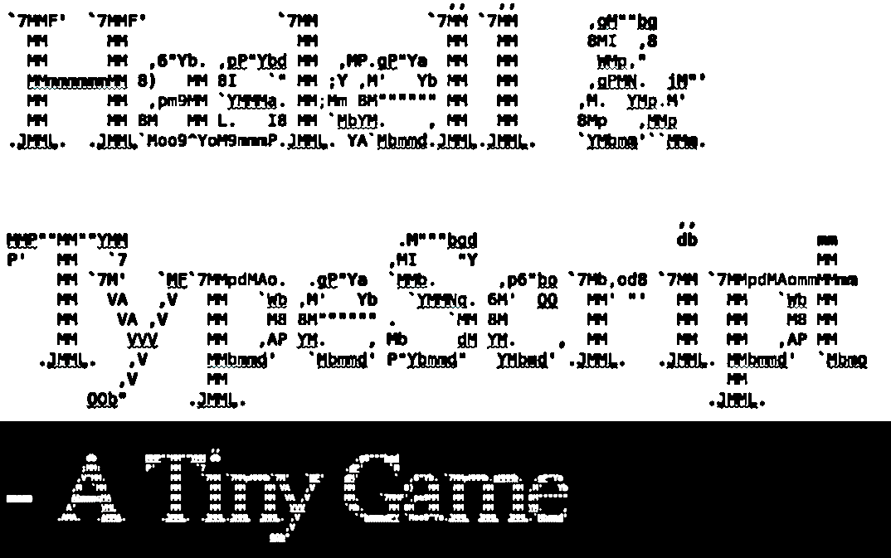

# A Haskell learning project

I wanted to learn about Haskell and handling side-effects in Haskell. A game-ish demo seemed like a suitable project. To understand Haskell better, I've made some comparisons with TypeScript that I believe is instructive.

My aim is to make 'the same' game/demo in Haskell and TypeScript. It's strictly speaking impossible to do 'fundamentalist' functional programming in JavaScript/TypeScript, but a functional 'style' is possible. And therefore I've attempted to mimic such a style in TypeScript (more suitable than JavaScript, since TypeScript, just like Haskell, is typed and also allows Generics).
