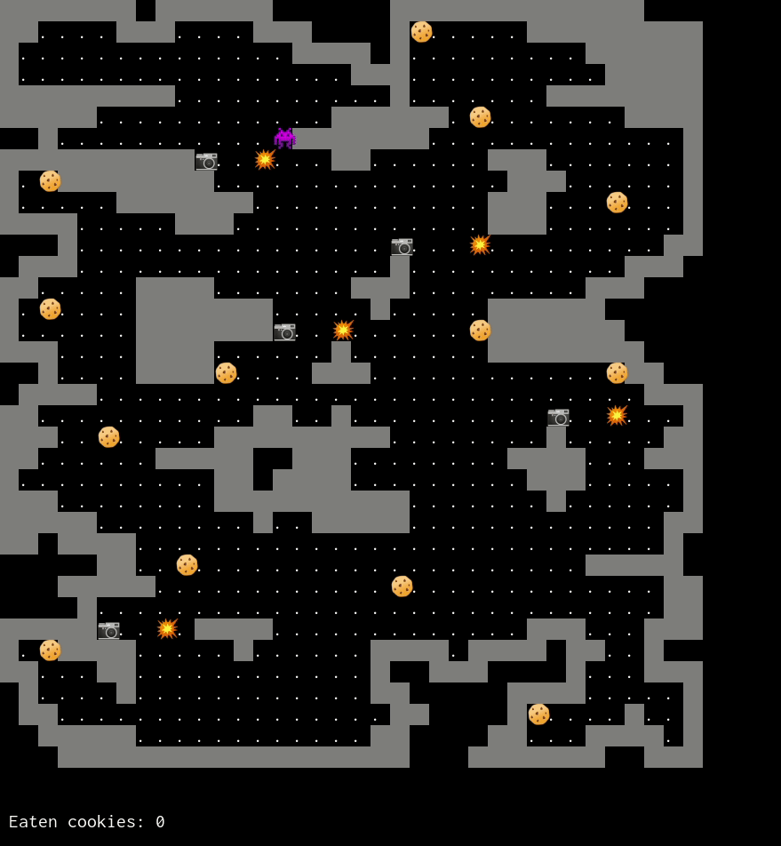

# A Haskell learning project

I wanted to learn about Haskell and handling side-effects in Haskell. A game-ish demo seemed like a suitable project. To understand Haskell better, I've made some comparisons with TypeScript that I believe is instructive.

My aim is to make 'the same' game/demo in Haskell and TypeScript.

## Screenshot from the Haskell version

