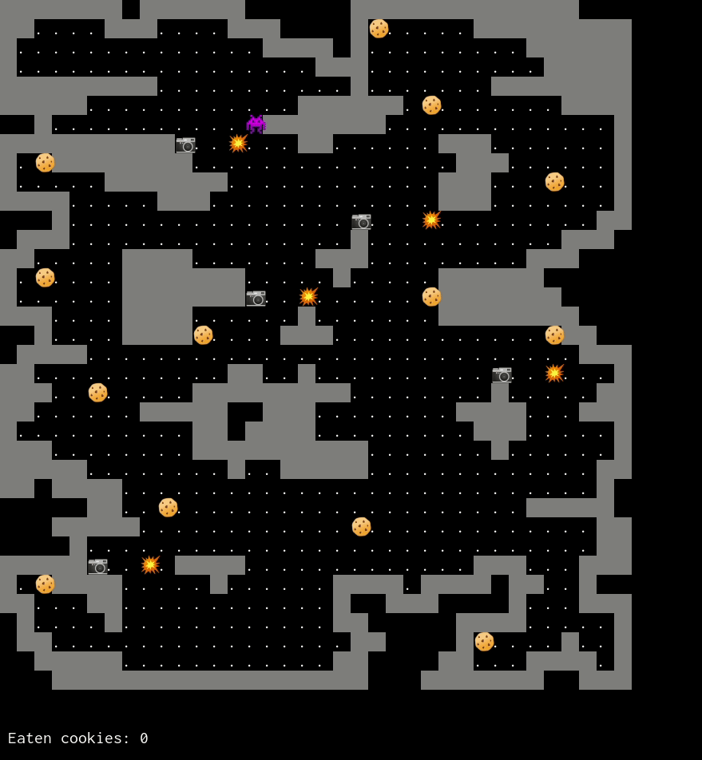

```
  ███    ███  ██████  ███    ██ ███████ ████████ ███████ ██████  
  ████  ████ ██    ██ ████   ██ ██         ██    ██      ██   ██ 
  ██ ████ ██ ██    ██ ██ ██  ██ ███████    ██    █████   ██████  
  ██  ██  ██ ██    ██ ██  ██ ██      ██    ██    ██      ██   ██ 
  ██      ██  ██████  ██   ████ ███████    ██    ███████ ██   ██ 
                                                                 
                                                                 
  ██     ██  █████  ███    ██ ████████ ███████                   
  ██     ██ ██   ██ ████   ██    ██    ██                        
  ██  █  ██ ███████ ██ ██  ██    ██    ███████                   
  ██ ███ ██ ██   ██ ██  ██ ██    ██         ██                   
   ███ ███  ██   ██ ██   ████    ██    ███████                   
                                                                 
                                                                 
   ██████  ██████   ██████  ██   ██ ██ ███████ ███████           
  ██      ██    ██ ██    ██ ██  ██  ██ ██      ██                
  ██      ██    ██ ██    ██ █████   ██ █████   ███████           
  ██      ██    ██ ██    ██ ██  ██  ██ ██           ██           
   ██████  ██████   ██████  ██   ██ ██ ███████ ███████           


  - A Tiny Haskell Game (learning project).
    By Claes-Magnus Berg <claes-magnus@herebeseaswines.net>
```



# Installation

I use stack. Use `stack build` and then `stack exec haskell-game-exe` to try.
